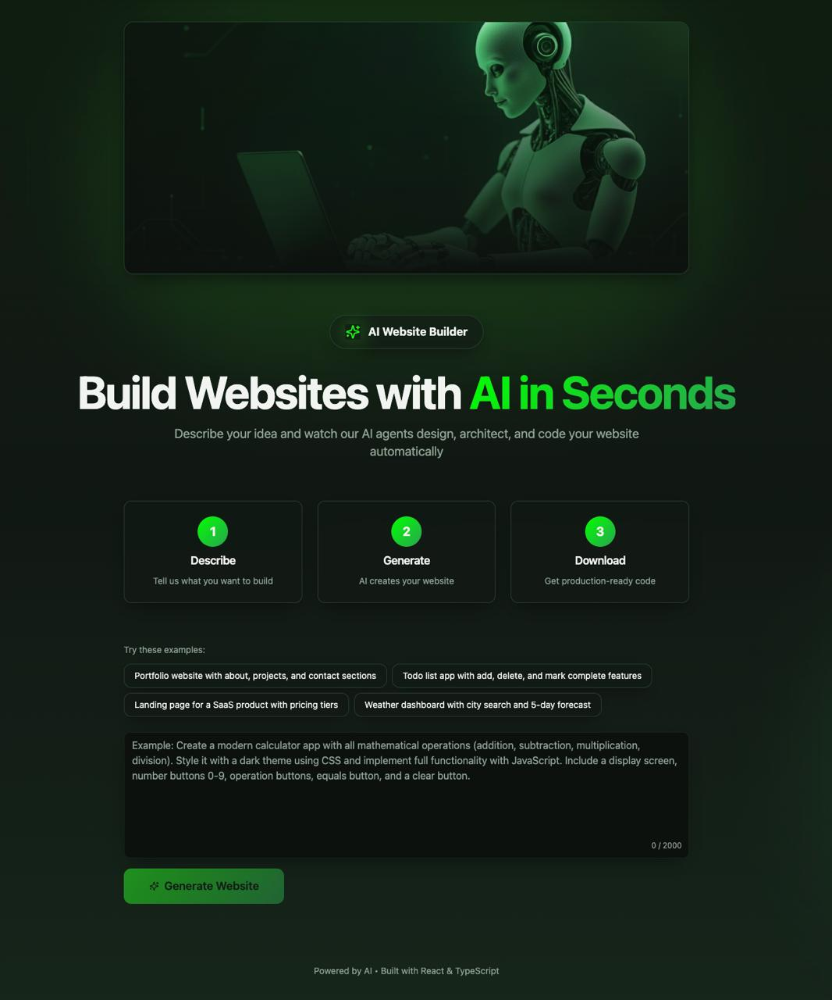
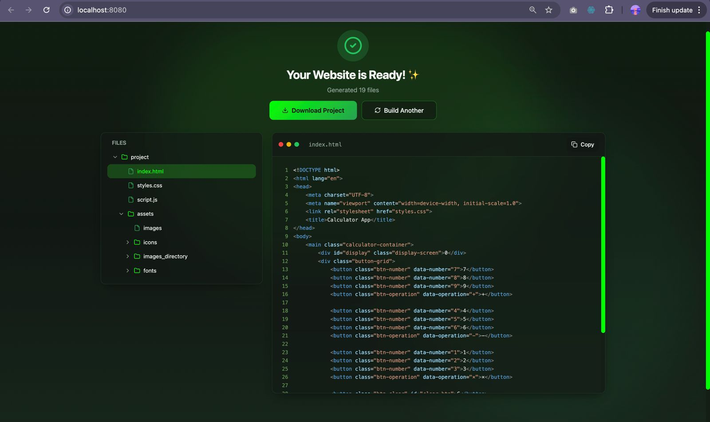

# Web Builder

An AI-powered web development assistant built with LangGraph and OpenAI. This tool leverages advanced language models to automate website creation, file management, and project scaffolding within a secure, sandboxed environment.

## Visual Interface

The landing page where the entire journey starts.. currently its a single turn agent.. like one cannot reiterate over the output website i.e the history state isnt saved. But works ongoing and soon it would be integrated. 



After running the entire workflow using your API_KEY he output will be generated in the following window



## Workflow

The Web Builder uses a LangGraph-based architecture to process user requests through a series of AI agents. Below is a visual representation of the workflow:

```mermaid
flowchart TD
    Start([User Prompt]) --> Planner[Planner Agent: Converts prompt to Plan]
    Planner --> Architect[Architect Agent: Creates TaskPlan]
    Architect --> Coder[Coder Agent: Processes implementation steps]
    Coder --> Check{All steps completed?}
    Check -->|Yes| End([Project Generated])
    Check -->|No| Coder
```

- **Planner Agent**: Analyzes the user's prompt and generates a high-level plan.
- **Architect Agent**: Breaks down the plan into actionable tasks.
- **Coder Agent**: Executes each task using tools to generate and modify files. It iterates until all tasks are complete.

This modular design ensures a structured and iterative approach to web development.

1. **Clone the Repository** (if applicable):
   ```bash
   git clone <repository-url>
   cd web-builder
   ```

2. **Set Up Virtual Environment**:
   ```bash
   python -m venv venv
   source venv/bin/activate  # On Windows: venv\Scripts\activate
   ```

4. **Install Server Dependencies**:
   ```bash
   pip install fastapi uvicorn
   ```
   (Note: These are already included in requirements.txt)

## Configuration

1. **Environment Variables**:
   - Copy `.env.example` to `.env` (if provided) or create a new `.env` file in the `agent/` directory.
   - Add your OpenAI API key:
     ```
     OPENAI_API_KEY=your_openai_api_key_here
     ```
   - Ensure other necessary variables (e.g., for LangSmith or additional services) are configured as needed.

2. **Project Root Initialization**:
   - The agent dynamically sets `PROJECT_ROOT` for secure file operations. Ensure your working directory is correctly configured.

## Running the Server

The application includes a FastAPI server that provides REST API endpoints for building websites asynchronously.

1. **Start the Server**:
   ```bash
   uvicorn agent.api:app --host 0.0.0.0 --port 8000 --reload
   ```
   Alternatively, you can run it using:
   ```bash
   python -m agent.main
   ```
   - Access the API at `http://localhost:8000` or your configured host/port.
   - The server includes CORS middleware for frontend integration.

2. **API Documentation and Inference**:
   - Once the server is running, visit `http://localhost:8000/docs` to access the interactive Swagger UI.
   - Use the Swagger docs to explore, test, and interact with the API endpoints for inference and website building.
   - This provides a user-friendly interface for sending requests and viewing responses without needing external tools.

3. **API Endpoints**:
   - `GET /`: Health check endpoint.
   - `POST /api/build-website`: Submit a user prompt to start building a website asynchronously. Returns a `task_id`.
   - `GET /api/status/{task_id}`: Check the status and progress of a build task.
   - `GET /api/result/{task_id}`: Get the final result of a completed build, including project path and files.
   - `GET /api/download/{task_id}`: Download the generated project as a ZIP file.
   - `GET /api/file/{task_id}/{file_path}`: Retrieve the content of a specific file from the project.
   - `DELETE /api/task/{task_id}`: Delete a task and its associated project files.
   - `GET /api/tasks`: List all tasks (for debugging).

4. **Example Usage**:
   - Send a POST request to `/api/build-website` with JSON: `{"user_prompt": "Create a simple portfolio website"}`.
   - Use the returned `task_id` to poll `/api/status/{task_id}` until the status is "completed".
   - Then, download or access files via the other endpoints.

## Usage (Direct Agent Execution)

For direct execution without the API server, you can run the agent programmatically. Note: This requires modifying the code to accept user input.

1. **Run the Agent**:
   - Create a simple script or modify `agent/main.py` to invoke the agent directly:
     ```python
     from agent.graph import agent
     from agent.tools import init_project_root

     # Initialize project root
     init_project_root()

     # Get user prompt (e.g., via input or argument)
     user_prompt = "Create a simple portfolio website"

     # Run the agent
     result = agent.invoke({"user_prompt": user_prompt}, {"recursion_limit": 100})
     print("Project generated successfully!")
     ```
   - Save this as a new script (e.g., `direct_run.py`) and run it: `python direct_run.py`.

2. **Generate Projects**:
   - The agent will create new project directories (e.g., `generated_project_1`) containing generated files, HTML, CSS, JavaScript, and other assets based on your specifications.
   - Use the provided tools for file creation, editing, and command execution within the secure boundaries.

3. **Monitor Logs**:
   - Check `agent_execution.log` for detailed execution history and any errors.

4. **Example Prompts**:
   - "Create a simple portfolio website with a home page, about section, and contact form."
   - "Build an e-commerce site for selling handmade crafts with product listings and a shopping cart."

```
web-builder/
├── agent/
│   ├── api.py            # FastAPI server for REST API endpoints
│   ├── main.py           # Entry point for direct agent execution
│   ├── graph.py          # Main LangGraph workflow definition
│   ├── tools.py          # File system and utility tools
│   ├── prompts.py        # Prompt templates for the AI agent
│   ├── states.py         # State management for the graph
│   └── .env              # Environment configuration
├── generated_project_*/  # Output directories for generated projects
├── requirements.txt      # Python dependencies (includes FastAPI, Uvicorn)
└── README.md             # This file
```

## Dependencies

- **LangChain & LangGraph**: For building the AI agent and workflow.
- **OpenAI**: For language model interactions.
- **FastAPI & Uvicorn**: For building and running the REST API server.
- **Python-DotEnv**: For loading environment variables.
- **Pydantic**: For data validation.
- **LangSmith**: For tracing and debugging (optional but recommended).
- **Pathlib2**: For additional path utilities.

## Contributing

1. Fork the repository.
2. Create a feature branch (`git checkout -b feature/AmazingFeature`).
3. Commit your changes (`git commit -m 'Add some AmazingFeature'`).
4. Push to the branch (`git push origin feature/AmazingFeature`).
5. Open a Pull Request.

## License

This project is licensed under the MIT License - see the [LICENSE](LICENSE) file for details.

## Support

For issues or questions, please open an issue on the repository or refer to the execution logs for debugging information.

---

*Built with ❤️ using LangGraph and OpenAI.*
